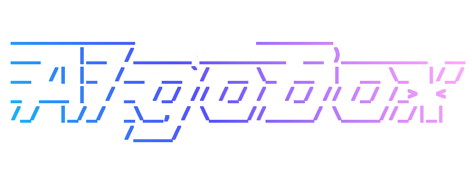

Algobox is an open source framework for writing, managing and running trading
strategies. It provides an interface and infrastructure for developing, deploying
and running algorithmic trading bots. It allows users to self-host these bots
on their own infrastructure, at home or in the cloud.

Think QuantConnect or Quantopian but self hosted.

The decision has been taken to implement necessary code from scratch,
as a learning experience. The project is not yet ready for general use,
though if you would like to contribute this would be welcome.

We have a trello board where we track todo's, bugs and more [here](https://trello.com/b/a4PSkfDs/algobox).

# todo
 - [ ] global models and a shared package for classes needed everywhere

# Workflow

Committing straight to master isn't really a crime when you're working alone and have no features or releases to break.. right?
